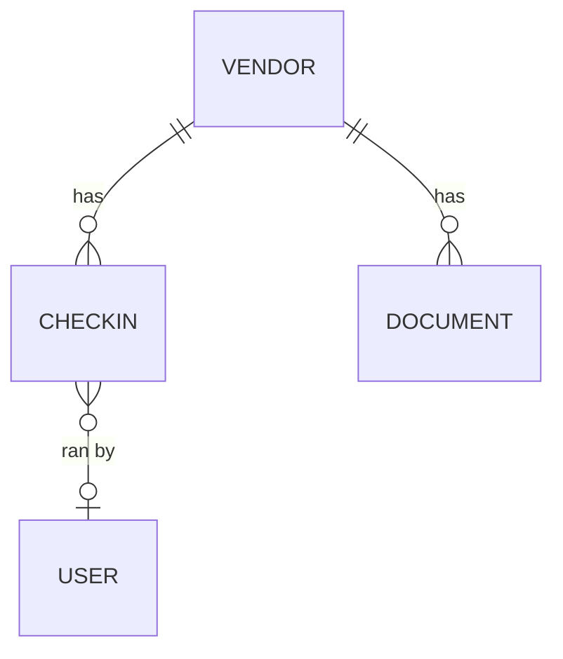

# Domain — <NAME_OF_YOUR_BUSINESS_CASE>

Fill this out, then hand it to Claude along with `ARCHITECTURE.md` and say: _"Read ARCHITECTURE.md. Apply those patterns to this domain."_

## One-line pitch

> _Example: "A tracker for a 12-week vendor-onboarding programme with weekly check-ins, document uploads, and risk sign-off."_

<!-- your line here -->

## Entities

List each entity with its fields. Mark required fields with `!`, optional with `?`, unique with `U`, enum values inline.

```
<EntityName>
- id (serial, pk)
- !code (text U)                    # e.g. "VEND-001"
- !title (text)
- description (text?)
- !status (enum: draft|active|closed)
- !createdAt (timestamp)
```

**Example — reuse or edit:**

```
Vendor
- id (serial, pk)
- !name (text)
- industry (text?)
- onboardedAt (timestamp?)

CheckIn
- id (serial, pk)
- !vendorId (fk → Vendor.id, cascade)
- !week (int)
- !scheduledAt (timestamp)
- !status (enum: upcoming|done|missed)
- notes (text?)

Document
- id (serial, pk)
- !vendorId (fk → Vendor.id, cascade)
- !name (text)
- !url (text)
- uploadedAt (timestamp)
```

<!-- your entities here -->

## Relationships (ER diagram)

Use Mermaid syntax — Claude can read this directly and generate Drizzle FK definitions.



<!-- your diagram here -->

## Permissions

For each entity action, who can do it?

| Entity · Action | Admin | Standard user |
|---|---|---|
| `Vendor` · list/read | ✅ all | ✅ all |
| `Vendor` · create/update/delete | ✅ | ❌ |
| `CheckIn` · list/read | ✅ all | ✅ all |
| `CheckIn` · create/update/delete | ✅ | ❌ |
| `Document` · upload | ✅ | ✅ (self-owned) |
| `Document` · delete | ✅ | ✅ (only own) |

**Per-user private content** (like `question_response` in Lummus) — list any. Use format `entity.field` scoped to user:

- _e.g._ `riskAssessment.body` — each user writes their own private risk assessment per vendor; admins see all

<!-- your permissions here -->

## Views (pages)

- [ ] **Dashboard** (`/`) — KPIs: `<field1>`, `<field2>`, `<field3>`. Prominent banner for next upcoming `<entity>`.
- [ ] **`/<entity>`** — card grid (or table?) listing all. Filters: `<filter1>`, `<filter2>`.
- [ ] **`/<entity>/[slug]`** — detail page. Main column: `<primary-info>`. Side column: `<related-entities>`, `<stats>`.
- [ ] **`/users`** (admin only) — role management, invite generation, password reset.
- [ ] **`/announcements`** — news feed (keep or drop).

<!-- your views here -->

## Seed data

What to prepopulate when someone runs `npm run db:seed`? A bootstrap set that shows off every feature.

- _e.g._ 5 vendors, 3 check-ins each, 10 documents, 2 announcements

<!-- your seed plan here -->

## Non-default behaviors

Anything that deviates from the Lummus blueprint. Leave blank if nothing.

- _e.g._ "document.url must be signed S3 URLs — expiry: 1 hour"
- _e.g._ "vendors with status=closed should be read-only even for admins"
- _e.g._ "drop the announcements module entirely"

<!-- your overrides here -->

## Branding / naming

- App title in sidebar: `<e.g. Vendor Ops>`
- Subtitle: `<e.g. Onboarding tracker>`
- Primary color accent: `<e.g. amber / emerald / zinc — matches shadcn neutral>`

---

## Prompt to paste into Claude

```
Read ARCHITECTURE.md and DOMAIN.md in this repo. Starting from the
Lummus codebase, apply the blueprint to the domain described in
DOMAIN.md:

1. Replace the domain tables in schema.ts with the new entities.
2. Write seed.ts with the seed data described.
3. Scaffold +page.server.ts + +page.svelte for each view in "Views".
4. Apply the permission rules from the Permissions table.
5. Keep the auth / users / invites / announcements modules as-is
   unless DOMAIN.md says to drop them.
6. Update the sidebar nav and app title/subtitle.

Run npm run check at the end. Smoke-test with curl.
```
